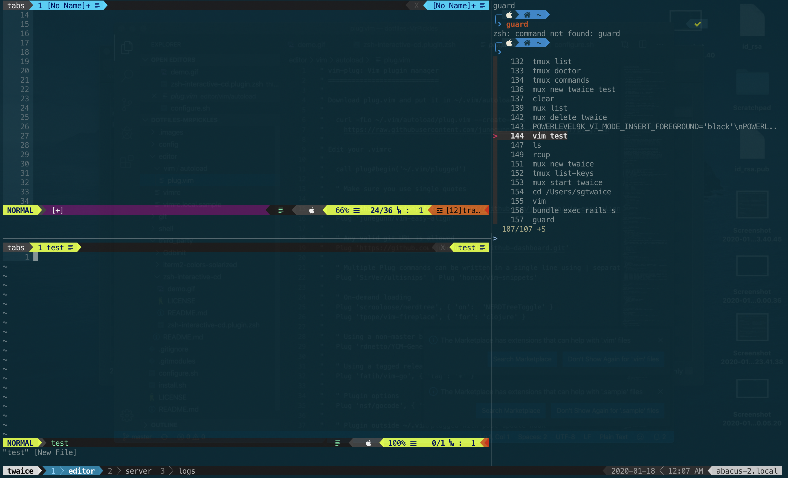
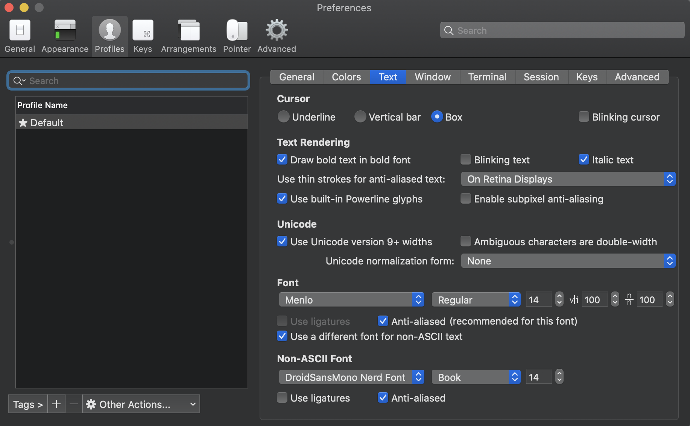

# Dotfiles 
Inspired by [Thoughtbot dotfiles](https://github.com/saksham/dotfiles) and the one from [MrPickles](https://github.com/MrPickles/dotfiles)



### Requirements
* Mac OSX
* ZSH
* Vim 8.0+ (or Neovim 0.3.1+)

## Setting up your Local Machine

_[Go to the next section](#installation) if you have already configured these
dotfiles on your machine once, or if you are SSHing into another machine.
These setup instructions only need to be done once on a local machine._

New machines require two tasks to be done which are not part of the setup
script:

* installing (and using) Powerline/Font Awesome-compatible fonts, and
* using the Solarized colorscheme.

### MacOS

#### Installing Fonts with Custom Glyph Support

We will be using [Nerd Fonts][nerd-fonts] to patch in all of our symbols.
This font aggregator is nice in the sense that it collects many different glyphs
from various sources.
(We'll be using a lot of different symbols!)

You'll first want to install a pre-patched font.
There are multiple ways to do this.
If you prefer to use the browser, download `Droid Sans Mono Nerd Font
Complete.otf` from the Nerd Fonts [prepatched fonts folder][prepatched].
Clicking on the file from Finder after downloading it should be sufficient.

Alternatively, if you have Homebrew, you can install it from the command line.

```shell
brew tap homebrew/cask-fonts
brew cask install font-droidsansmono-nerd-font
```

Next, you'll want to configure iTerm to use the new font.

1. Go to the `Text` tab in your current iTerm profile and select the option to
   `Use a different font for non-ASCII text`.
2. In the same tab, select `Droid Sans Mono Nerd Font` as the font for non-ASCII
   text.

The Powerline symbols included in the font might not align well.
As a remedy, iTerm has a `Use built-in Powerline glyphs` option to substitute
the characters with its own built-in alternative characters.
I'd recommend checking that option.

The Text section of my iTerm settings looks like the picture below.
For ASCII text, I use `Menlo Regular` (which is a native font) and use `14pt`
for all font types.



#### Solarized on iTerm

The Solarized colors for iTerm can be found in its
[official repository][solarized-repo].
Import [`Solarized Dark.itermcolors`][itermcolors] as a colorscheme for iTerm.
In the `Colors` section of your iTerm profile, use the `Solarized Dark` preset.

#### Enable Copy/Paste in Tmux

On Macs, `pbcopy` and `pbpaste` don't natively work in tmux.
Luckly there's a [Homebrew][homebrew] formula to fix that.

```shell
brew install reattach-to-user-namespace
```

The tmux configuration will do the rest for you.
Note that this only applies to machines running MacOS.

#### Enable Mouse Wheel Scrolling in Vim on iTerm

If using iTerm, setting `Scroll wheel sends arrow keys when in alternate screen
mode.` to `Yes` will allow trackpad scrolling while in Vim.
The setting can be found in the advanced preferences.

#### Enabling the Meta Key on iTerm

If using iTerm, you may want to set the option key mode to `Esc+` to make it be
a meta key.
It's used for a few shortcuts, such as resizing tmux panes.


### Installation

* Install [rcm](https://github.com/thoughtbot/rcm):
  ```
    brew tap thoughtbot/formulae
    brew install rcm
  ```
* Create a folder called settings in your $HOME directory.
* Clone onto your laptop using the following command.(Or, [fork and keep your fork updated](http://robots.thoughtbot.com/keeping-a-github-fork-updated)).
  ```
   git clone https://github.com/saksham/dotfiles ~/settings/dotfiles
  ```
* Install the dotfiles:
  ```
    env RCRC=$HOME/settings/dotfiles/rcrc rcup
  ```
  
After the initial installation, you can run `rcup` without the one-time variable
`RCRC` being set (`rcup` will symlink the repo's `rcrc` to `~/.rcrc` for future
runs of `rcup`). [See
example](https://github.com/thoughtbot/dotfiles/blob/master/rcrc).

This command will create symlinks for config files in your home directory.
Setting the `RCRC` environment variable tells `rcup` to use standard
configuration options:


### Update

From time to time you should pull down any updates to these dotfiles, and run `rcup` to link any new files and install new vim plugins.

### Customization

Create a directory for your personal customizations:

    mkdir ~/dotfiles-local

Put your customizations in `~/dotfiles-local` appended with `.local`:

* `~/dotfiles-local/aliases.local`
* `~/dotfiles-local/git_template.local/*`
* `~/dotfiles-local/gitconfig.local`
* `~/dotfiles-local/psqlrc.local` (we supply a blank `.psqlrc.local` to prevent `psql` from
  throwing an error, but you should overwrite the file with your own copy)
* `~/dotfiles-local/tmux.conf.local`
* `~/dotfiles-local/vimrc.local`
* `~/dotfiles-local/vimrc.bundles.local`
* `~/dotfiles-local/zshrc.local`
* `~/dotfiles-local/zsh/configs/*`

For example, your `~/dotfiles-local/aliases.local` might look like this:

    # Productivity
    alias todo='$EDITOR ~/.todo'

Your `~/dotfiles-local/gitconfig.local` might look like this:

    [alias]
      l = log --pretty=colored
    [pretty]
      colored = format:%Cred%h%Creset %s %Cgreen(%cr) %C(bold blue)%an%Creset
    [user]
      name = Dan Croak
      email = dan@thoughtbot.com

Your `~/dotfiles-local/vimrc.local` might look like this:

    " Color scheme
    colorscheme github
    highlight NonText guibg=#060606
    highlight Folded  guibg=#0A0A0A guifg=#9090D0

If you don't wish to install a vim plugin from the default set of vim plugins in
`.vimrc.bundles`, you can ignore the plugin by calling it out with `UnPlug` in
your `~/.vimrc.bundles.local`.

    " Don't install vim-scripts/tComment
    UnPlug 'tComment'

`UnPlug` can be used to install your own fork of a plugin or to install a shared
plugin with different custom options.

    " Only load vim-coffee-script if a Coffeescript buffer is created
    UnPlug 'vim-coffee-script'
    Plug 'kchmck/vim-coffee-script', { 'for': 'coffee' }

    " Use a personal fork of vim-run-interactive
    UnPlug 'vim-run-interactive'
    Plug '$HOME/plugins/vim-run-interactive'

To extend your `git` hooks, create executable scripts in
`~/dotfiles-local/git_template.local/hooks/*` files.

Your `~/dotfiles-local/zshrc.local` might look like this:

    # load pyenv if available
    if which pyenv &>/dev/null ; then
      eval "$(pyenv init -)"
    fi

Your `~/dotfiles-local/vimrc.bundles.local` might look like this:

    Plug 'Lokaltog/vim-powerline'
    Plug 'stephenmckinney/vim-solarized-powerline'

#### zsh Configurations

Additional zsh configuration can go under the `~/dotfiles-local/zsh/configs` directory. This
has two special subdirectories: `pre` for files that must be loaded first, and
`post` for files that must be loaded last.

For example, `~/dotfiles-local/zsh/configs/pre/virtualenv` makes use of various shell
features which may be affected by your settings, so load it first:

    # Load the virtualenv wrapper
    . /usr/local/bin/virtualenvwrapper.sh

Setting a key binding can happen in `~/dotfiles-local/zsh/configs/keys`:

    # Grep anywhere with ^G
    bindkey -s '^G' ' | grep '

Some changes, like `chpwd`, must happen in `~/dotfiles-local/zsh/configs/post/chpwd`:

    # Show the entries in a directory whenever you cd in
    function chpwd {
      ls
    }

This directory is handy for combining dotfiles from multiple teams; one team
can add the `virtualenv` file, another `keys`, and a third `chpwd`.

The `~/dotfiles-local/zshrc.local` is loaded after `~/dotfiles-local/zsh/configs`.

#### vim Configurations


Similarly to the zsh configuration directory as described above, vim
automatically loads all files in the `~/dotfiles-local/vim/plugin` directory. This does not
have the same `pre` or `post` subdirectory support that our `zshrc` has.

This is an example `~/dotfiles-local/vim/plugin/c.vim`. It is loaded every time vim starts,
regardless of the file name:

    # Indent C programs according to BSD style(9)
    set cinoptions=:0,t0,+4,(4
    autocmd BufNewFile,BufRead *.[ch] setlocal sw=0 ts=8 noet

### Other optional tools

There are a few recommended (but optional) tools you can install to improve your
shell experience in general.

* [`diff-so-fancy`][diff-so-fancy]: Diff-so-fancy is a diffing tool that gives a
  nicer diff than the git default.
* [`rg`][rg]: Ripgrep is a faster alternative over `ag`, `ack`, and `grep`.
  It has the exact same usage as `ag` and is likely more preferable in all use
  cases.
* [`fzf`][fzf]: Fzf is a general purpose fuzzy funder.
* [`fd`][fd]: `fd` is a faster alternative to the `find` command.
  It works very well when paired with `fzf`.
* `tree`: This will display the directory structure as a tree. We use it to
  improve the output of `ALT-C` from `fzf`.
* [`bat`][bat]: An improved version of `cat`. We use it for the file previews
  when running `CTRL-T` from `fzf`.

You should install all of these independently of this dotfile repo.
(This also includes figuring out how to install them.)
Most of these are Homebrew packages on MacOS (or a target in most Linux package
managers).

Thanks
------
* [Thoughtbot dotfiles](https://github.com/thoughtbot/dotfiles)
* [MrPickles/dotfiles](https://github.com/MrPickles/dotfiles)


